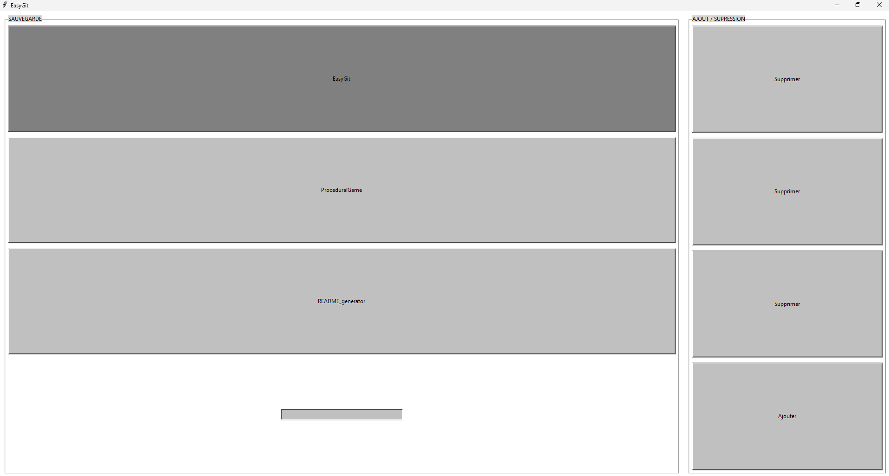

# EasyGit UI

---

## 🚀 Project Home
Welcome to my project's wiki page!
This page serves as the central entry point for all essential information regarding the **EasyGit** project.



---

## 🔍 Project Overview
EasyGit UI is a desktop application designed to simplify managing multiple Git repositories simultaneously.
No more juggling between different terminal windows!
With EasyGit, you can perform common Git operations (git add ., git commit, git push, git pull) for up to four projects at once, all through a simple and intuitive graphical interface.

---

## 🕹️ Features
* **Multi-project management**: Manage up to 4 Git projects in parallel.
* **Persistent saving**: Project names and paths are stored via a JSON file.
* **Intuitive interface**: Built with Tkinter for a simple user experience.
* **Simplified Git operations**:
    * `git add .`: Add all modified files to the "staging area."
    * `git commit -m "Message"`: Save changes with a customizable message.
    * `git push`: Send changes to the remote repository.
    * `git pull`: Retrieve the latest changes from the remote repository.

---

## 📈 Project Architecture
* `main.py`: Manages the user interface.
* `Files/Saves.py`: Handles JSON file reading for saved projects.
* `Files/Git.py`: Handles JSON file reading for Git commands (Note: this seems like a typo and should likely be related to Git operations, not JSON reading again).
* `SAVE/Save1.json`: Save file 1
* `SAVE/Save2.json`: Save file 2
* `SAVE/Save3.json`: Save file 3
* `SAVE/Save4.json`: Save file 4
* `exe/EasyGit.exe`: Windows application executable

# ⚙️ Technologies Used
* **Python**
* **Tkinter**: For the Graphical User Interface (GUI).
* **Subprocess**: To execute Git commands in the background.
* **JSON**: For data persistence (saving/loading projects).
* **Pyinstaller**: To create an executable.

---

## ▶️ Quick Start
To clone the project, and run the application locally:

Clone this repository in bash:
```bash
git clone [https://github.com/MathysFernandez/EasyGit.git](https://github.com/MathysFernandez/EasyGit.git)
```
